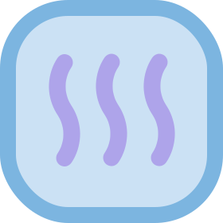

#  da4a (?)

[badge_release_img]: https://img.shields.io/github/v/release/suk-ws/da4a?display_name=release&label=latest&color=#00fa9a
[badge_release_target]: https://mvn.sukazyo.cc/#/releases/cc/sukazyo/da4a
[badge_tests_img]: https://img.shields.io/github/actions/workflow/status/suk-ws/da4a/test?label=Tests&color=dark-green
[badge_snapshot_img]: https://img.shields.io/maven-metadata/v?metadataUrl=https%3A%2F%2Fmvn.sukazyo.cc%2Fsnapshots%2Fcc%2Fsukazyo%2Fda4a%2Fmaven-metadata.xml&label=snapshots&color=%231e90ff
[badge_snapshot_target]: https://mvn.sukazyo.cc/#/snapshots/cc/sukazyo/da4a
[![GitHub release][badge_release_img]][badge_release_target]  
[![Maven metadata of snapshots][badge_snapshot_img]][badge_snapshot_target]  
![GitHub Workflow Status of test][badge_tests_img]

A util-like standard library written in Scala and for Scala/Java.

With a random project name.

## Supported Platforms

Both Scala3 and Java aimed to be supported.

However, due to my primary-used platform is Scala3, and I need to make
it available on it as soon as possible to support developing for my
other project. Undercurrent stage, we haven't taken enough time and
efforts to do test on the Java platform. So the features may not be easy
to use with Java.

For the Scala2 platform, I am poor with the scala/sbt build system and
cannot work easily with cross-compile in sbt. Additions the reason
I have just claimed in the above paragraph, the Scala2 support may not
come so quickly without any contributions.

## What it contains?

It contains utils, DSLs for scala, and some tiny feature modules that
can be used in many projects. This aims to combine the duplicated util
code used in multiple projects.

Current features:

- Bytes data processing
  - Convert a singed byte (or a byte array) to a HEX string
- Scala DSLs provide a way to do more simple jobs easier
  - some commonly used math operator (`/-/`(over), `*^`(pow))
  - extension methods to encapsulate values to scala base data types
- Library Tools
  - GivenContext -— put(provide) and get(use) variables using its type as
    the key
- Series random utils (currently only weighted boolean)
- Numeric Statistics from the Morny project.

Scheduled features:

- All the util modules in the existing project (Morny, etc.) that are
  reusable and have a weight.

## Contributes

Feel free to PRs for any reason, include but not only the new features,
docs, tests, bug fixes...
